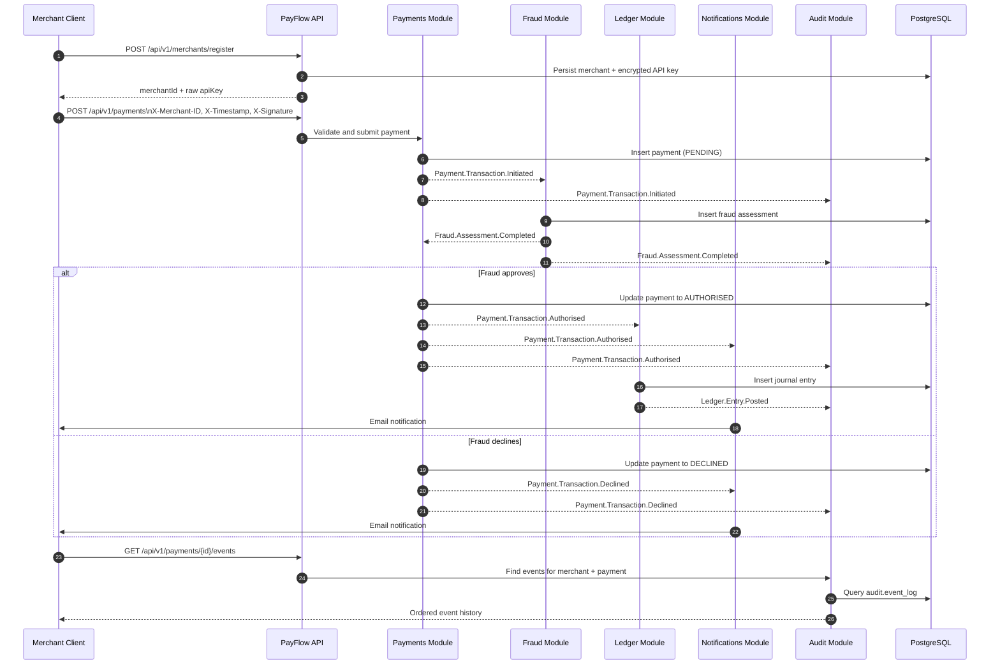

# PayFlow

PayFlow is a modular monolith payment system built with Spring Boot, Spring Security, Spring Data JPA, Flyway, and Spring Modulith. It supports merchant registration, HMAC-signed API access, payment ingestion, fraud assessment, ledger posting, email notifications, and merchant-scoped audit history.

## What It Does

Current implemented flow:

1. A merchant registers and receives a raw API key.
2. The merchant signs requests with HMAC-SHA256 using that API key.
3. A payment is created in `PENDING`.
4. The fraud module evaluates the payment.
5. The payment is marked `AUTHORISED` or `DECLINED`.
6. Authorised payments generate a ledger entry.
7. Notifications send merchant email for final outcomes.
8. Audit persists the full event history.

## Stack

- Java 21
- Spring Boot 4.0.4
- Spring Security
- Spring Data JPA
- Spring Modulith 2.0.3
- Flyway
- PostgreSQL 16
- H2 for tests
- Maven

## Modules

- `merchant`
  Merchant registration, API key issuance, API key rotation, merchant lookup.
- `payments`
  Payment API, idempotency, payment state transitions, payment event history.
- `fraud`
  Rule-based fraud checks and fraud assessment query API.
- `ledger`
  Double-entry journal posting and journal lookup API.
- `notifications`
  Async email notifications using Spring Mail and Gmail SMTP.
- `audit`
  Merchant-scoped audit event persistence and audit query API.
- `shared`
  Shared events, error handling, response wrappers, common types.

## Sequence Flow



## Authentication

`POST /api/v1/merchants/register` is public.

All other endpoints require these headers:

- `X-Merchant-ID`
- `X-Timestamp`
- `X-Signature`

Signing model:

- Algorithm: `HmacSHA256`
- Payload: `timestamp + "." + body`
- Signature format: lowercase hex
- Max timestamp age: 300 seconds

For `GET` requests, the body is empty, so the payload becomes:

```text
timestamp.
```

If the signature is missing, invalid, or expired, the API returns `401`.

## Local Run

Start PostgreSQL:

```bash
docker compose up -d
```

Run the app:

```bash
./mvnw spring-boot:run
```

Run tests:

```bash
./mvnw test
```

## Configuration

Primary config lives in [application.properties](/home/abdul/Desktop/github_projects/Pay-Flow/src/main/resources/application.properties).

Main environment variables:

- `DATABASE_URL`
- `DATABASE_USER`
- `DATABASE_PASSWORD`
- `ENCRYPTION_SECRET`
- `LOG_FILE`
- `MAIL_USERNAME`
- `MAIL_PASSWORD`
- `MAIL_FROM`
- `JWK_SET_URI`

Notes:

- Flyway manages schema changes.
- Virtual threads are enabled.
- The current config still contains development fallback values and should be cleaned up before any real deployment.

## Database Schemas

- `payments`
- `merchant`
- `fraud`
- `ledger`
- `notifications`
- `audit`

Flyway migrations are under `src/main/resources/db/migration/postgresql`.

## API Surface

Base URL:

```text
http://localhost:8080/api/v1
```

### Merchant

- `POST /merchants/register`
- `POST /merchants/keys/rotate`

### Payments

- `POST /payments`
- `GET /payments`
- `GET /payments/{id}`
- `GET /payments/{id}/events`

### Fraud

- `GET /fraud/assessments/{transactionId}`

### Ledger

- `GET /ledger/journal/{correlationId}`

### Audit

- `GET /audit/events`

## Example Requests

### Register Merchant

```bash
curl -X POST http://localhost:8080/api/v1/merchants/register \
  -H "Content-Type: application/json" \
  -d '{
    "name": "Acme Corp",
    "email": "merchant@example.com"
  }'
```

### Payment Request Body

```json
{
  "payeeAccountId": "11111111-1111-1111-1111-111111111111",
  "idempotencyKey": "unique-client-key-123",
  "amount": "150.00",
  "currency": "USD",
  "paymentMethod": {
    "type": "CARD",
    "token": "tok_test_1234"
  }
}
```

### Generate Signature

```bash
TIMESTAMP=$(date +%s)
BODY='{"payeeAccountId":"11111111-1111-1111-1111-111111111111","idempotencyKey":"unique-client-key-123","amount":"150.00","currency":"USD","paymentMethod":{"type":"CARD","token":"tok_test_1234"}}'
SIGNATURE=$(printf '%s.%s' "$TIMESTAMP" "$BODY" | openssl dgst -sha256 -hmac "$API_KEY" -hex | sed 's/^.* //')
```

### Submit Payment

```bash
curl -X POST http://localhost:8080/api/v1/payments \
  -H "Content-Type: application/json" \
  -H "X-Merchant-ID: $MERCHANT_ID" \
  -H "X-Timestamp: $TIMESTAMP" \
  -H "X-Signature: $SIGNATURE" \
  -d "$BODY"
```

## Error Handling

Current error behavior:

- `NotFoundException` -> `404`
- `DomainException` -> `409`
- unexpected exception -> `500`
- invalid signature/auth -> `401`

Response wrapper shape:

```json
{
  "data": null,
  "message": "Error message",
  "statusCode": 404
}
```

The unauthorized signature response is currently written directly by the filter.

## Testing

The project currently has coverage for:

- merchant controller and module boundaries
- payment controller and service behavior
- fraud controller and listener behavior
- ledger controller and service behavior
- audit controller and service behavior

Current suite status:

- `33` tests
- `0` failures
- `0` errors

## Current Tradeoffs

- Authentication is API-key plus HMAC, not a full OAuth2/JWT flow.
- API key recovery is not implemented yet.
- Swagger/OpenAPI is intentionally not included.
- Audit payloads are stored as serialized JSON.
- Ledger lookup is merchant-scoped and only returns entries for the authenticated merchant.
- Development defaults remain in config and should be removed before deployment.

## Next Good Improvements

- Merchant-scope the ledger journal lookup
- Remove committed fallback secrets from config
- Add Postgres/Testcontainers integration coverage
- Add deployment notes for Railway or Render
